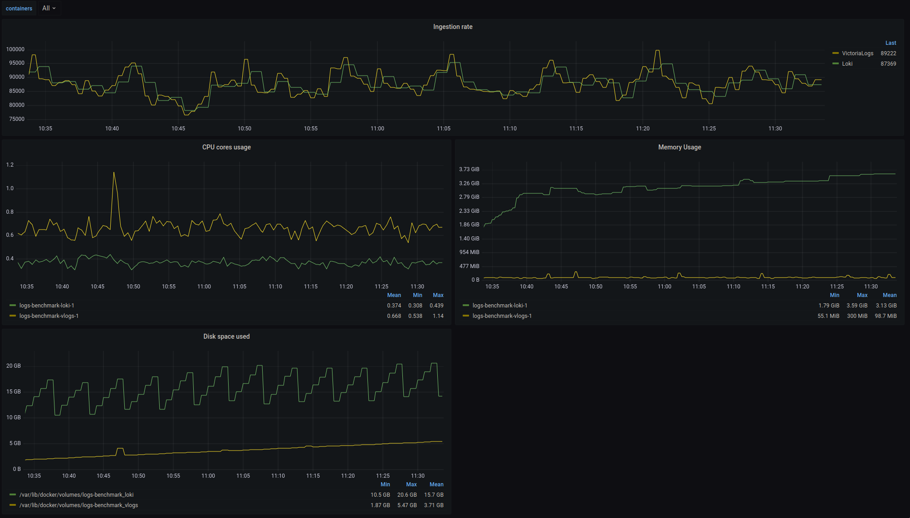

# Benchmark for Elasticsearch vs VictoriaLogs vs Loki

Benchmark compares VictoriaLogs, ELK stack and Grafana Loki.

Benchmark is based on:

- Logs from this repository - https://github.com/logpai/loghub
- [logs generator](./generator)

For ELK suite it uses:

- filebeat - https://www.elastic.co/beats/filebeat
- elastic + kibana

For Grafana Loki suite it uses:

- [Promtail](https://grafana.com/docs/loki/latest/send-data/promtail/)
- rsyslog - required to push logs in RFC5424 format to Promtail
- [Loki](https://grafana.com/oss/loki/)

## How it works

[docker-compose.yml](./docker-compose.yml) contains common configurations for all suites:

- VictoriaLogs instance
- vmsingle - port forwarded to `localhost:8428` to see UI
- exporters for system metris

ELK suite uses [docker-compose-elk.yml](./docker-compose-elk.yml) with the following services:

- [logs generator](./generator)  which generates logs and sends them to filebeat instances via syslog
- 2 filebeat instances - one for elastic and one for VictoriaLogs.
- elastic instance
- kibana instance - port forwarded to `localhost:5601` to see UI

Loki suite uses [docker-compose-loki.yml](./docker-compose-loki.yml) with the following services:

- [logs generator](./generator)  which generates logs and sends them rsyslog
- rsyslog instance - sends logs to Promtail
- Promtail instance - sends logs to Loki and VictoriaLogs
- Loki instance

[Logs generator](./generator) generates logs based on logs located at `./source_logs/logs` and sends them to filebeat
instances via syslog.
Logs are generated by reading files line by line, adding randomized suffix to each line and sending them to filebeat via
syslog.
By default, generator will exit once all files are read. `docker-compose` will restart it and files will be read again
generating new logs.

Each filebeat than writes logs to elastic and VictoriaLogs via elasticsearch-compatible API.

## How to run

1. Download and unarchive logs by running:

```shell
cd source_logs 
bash download.sh
```

Note that with logs listed in `download.sh` it will require 49GB of free space:

- 3GB for archives
- 46GB for unarchived logs

If it is needed to minimize disk footprint, you can download only some of them by commenting out lines in `download.sh`.
Unarchived logs size per file for reference:

```shell
2.3M Linux.log
 73M SSH.log
 32G Thunderbird.log
5.1M Apache.log
 13G hadoop-*.log
```

2. (optional) If needed, adjust amount of logs sent by generator by modifying `-outputRateLimitItems` and
   `outputRateLimitPeriod` parameters in [docker-compose.yml](./docker-compose.yml). By default, it is configured to
   send 10000 logs per second.

3. (optional) Build victoria-logs image and adjust `image` parameter in [docker-compose.yml](./docker-compose.yml):

```shell
make package-victoria-logs
```

Image name should be replaced at `vlogs` service in [docker-compose.yml](./docker-compose.yml).

It is also possible to configure filebeat to send logs to VictoriaLogs running on local machine.
To do this modify [filebeat config for vlogs](./elk/filebeat/filebeat-vlogs.yml) and replace `vlogs` address
with address of local VictoriaLogs instance:

```yaml
output.elasticsearch:
  hosts: [ "http://vlogs:9428/insert/elasticsearch/" ]
```

4. Choose a suite to run.

   In order to run ELK suite use the following command:
   ```
   make docker-up-elk
   ```
   In order to run Loki suite use the following command:
   ```
   make docker-up-loki
   ```


5. Navigate to `http://localhost:3000/` to see Grafana dashboards with resource usage
   comparison.

   Navigate to `http://localhost:3000/d/hkm6P6_4z/elastic-vs-vlogs` to see ELK suite results.

   Navigate to `http://localhost:3000/d/hkm6P6_4y/loki-vs-vlogs` to see Loki suite results.


Example results vs ELK:


Example results vs Loki:


